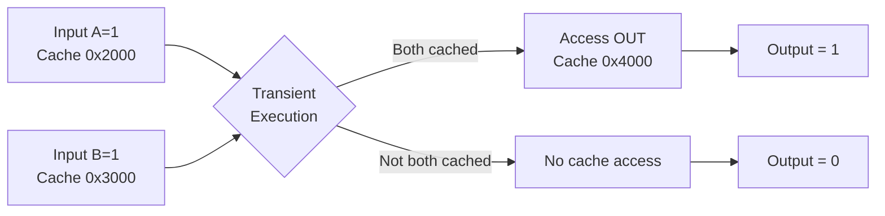

# Tutorial 1: Building Your First µWM - The AND Gate

## 🎯 Learning Objectives

By the end of this tutorial, you will:
- Understand the fundamental concepts of Microarchitectural Weird Machines (µWMs)
- Learn how exception-based transient execution works (GITM framework)
- Build and test a simple AND gate using cache side-effects
- Analyze execution traces to verify µWM behavior

**Prerequisites:** Basic understanding of x86-64 assembly, CPU architecture concepts  
**Difficulty:** Beginner  
**Time:** 15-20 minutes

---

## 📚 Background: What is a µWM?

A **Microarchitectural Weird Machine (µWM)** is a computational system that performs logic operations using **microarchitectural side-effects** rather than traditional architectural state changes. Instead of writing results to registers or memory, µWMs encode outputs in:
- **Cache state** (which addresses are cached)
- **Return Stack Buffer (RSB)** predictions
- **Branch predictor** state
- Other microarchitectural structures

### Why "Weird"?

Traditional computing:
```nasm
mov rax, 5      ; Store 5 in register rax
add rax, 3      ; Add 3 to rax
; Result: rax = 8 (architectural state)
```

µWM computing:
```nasm
div dl          ; Trigger exception (transient execution)
mov al, [rcx]   ; This instruction NEVER commits!
; But it causes cache side-effect...
; Result: Output encoded in cache state! 🤯
```

---

## 🔧 The AND Gate µWM

### Conceptual Overview

An AND gate outputs `1` only when **both** inputs are `1`:

| Input A | Input B | Output |
|---------|---------|--------|
| 0       | 0       | 0      |
| 0       | 1       | 0      |
| 1       | 0       | 0      |
| 1       | 1       | 1      |

### GITM Encoding Strategy

The **GITM (Ghost in the Machine)** framework uses **exception-based transient execution**:

1. **Input Encoding:** Prime the cache with addresses representing input bits
   - If input = 1: Cache address `IN[i]`
   - If input = 0: Don't cache anything

2. **Computation:** Trigger an exception to enter transient execution
   - CPU speculatively executes instructions that will never commit
   - These instructions compute using **cached addresses**

3. **Output Encoding:** Cache an output address only if computation succeeds
   - Output = 1: Address `OUT` is cached
   - Output = 0: Address `OUT` is NOT cached

### Architecture Diagram



---

## 💻 Assembly Implementation

Here's the complete AND gate implementation using GITM:

```nasm
BITS 64
DEFAULT REL

section .text
global _start

_start:
    ; ====================================
    ; 1. Trigger Exception (Division by Zero)
    ; ====================================
    xor rdx, rdx               ; rdx = 0
    div dl                     ; Divide by zero -> EXCEPTION!
                               ; Everything after this is TRANSIENT

    ; ====================================
    ; 2. Transient AND Computation
    ; ====================================
    ; Load first input from memory
    movzx rcx, byte [r13]      ; rcx = In1[0] (0 or 1)
    
    ; Use In1 as index to access In2 array
    add rcx, r14               ; rcx = &In2[In1[0]]
    
    ; Load second input (nested access)
    movzx rdx, byte [rcx]      ; rdx = In2[In1[0]]
    
    ; Use result as index to output array
    add rdx, r15               ; rdx = &Out[In2[In1[0]]]
    
    ; Cache the output address (side-effect!)
    mov dl, byte [rdx]         ; Access Out[...] -> CACHED!
```

### How It Works

**Case 1: Both inputs are 1**
- `In1[0]` is cached (because input A = 1)
- `In2[0]` is cached (because input B = 1)
- Transient load succeeds: `rcx = In1[0] = 0`
- Transient load succeeds: `rdx = In2[0] = 0`
- Final address: `Out[0]` → **Gets cached** ✅
- **Result: Output = 1**

**Case 2: Input A=0, B=1**
- `In1[0]` is **NOT** cached
- First transient load causes **cache miss** (slow!)
- Transient window expires before final access
- `Out[0]` is **NOT** cached ❌
- **Result: Output = 0**

**Case 3: Input A=1, B=0**
- `In1[0]` is cached
- `In2[0]` is **NOT** cached
- Second transient load misses
- `Out[0]` is **NOT** cached ❌
- **Result: Output = 0**

**Case 4: Both inputs are 0**
- `In1[0]` is **NOT** cached
- First load fails immediately
- **Result: Output = 0**

---

## 🧪 Testing with WeMu

### Step 1: Locate the Test Code

The AND gate test is located in `/src/unit_tests.py`:

```python
def test_gitm_and() -> bool:
    verifier = lambda a, b: a and b
    return run_gate_test('AND', emulate_gitm_and, verifier, 2)
```

### Step 2: Run the Test

```bash
cd src
python unit_tests.py test_gitm_and
```

### Expected Output

```
--- Running test_gitm_and ---
Test passed for AND(0, 0)
Test passed for AND(0, 1)
Test passed for AND(1, 0)
Test passed for AND(1, 1)
```

### Step 3: Enable Debug Traces

To see detailed execution traces, modify `/src/tests/gitm_tests.py`:

```python
def emulate_gitm_and(in1: int, in2: int) -> int:
    return _emulate_gitm_gate(
        name='gitm_and',
        elf_path='gates/gitm/main_and_objump.txt',
        start_addr=0x401106,
        end_addr=0x40111c,
        in_addrs=(0x404040, 0x404050),
        in_bits=(in1, in2),
        out_addrs=(0x404060,),
        debug=True  # ← Enable debugging!
    )[0]
```

Re-run the test to see the execution trace in `output/gitm_and/emulation_log.txt`.

---

## 📊 Analyzing the Execution Trace

When you enable debug mode, WeMu generates detailed logs. Here's what to look for:

### Key Log Entries

```
Starting emulation of gitm_and with bits=(1, 1) ...
[0x401106] xor rdx, rdx
[0x401109] div dl          ← EXCEPTION HERE
[TRANSIENT] movzx rcx, byte [r13]
[TRANSIENT] Cache HIT at 0x404040 (In1)
[TRANSIENT] add rcx, r14
[TRANSIENT] movzx rdx, byte [rcx]
[TRANSIENT] Cache HIT at 0x404050 (In2)
[TRANSIENT] add rdx, r15
[TRANSIENT] mov dl, byte [rdx]
[TRANSIENT] Cache WRITE at 0x404060 (Out) ← OUTPUT!
```

### Understanding the States

- **[COMMITTED]:** Instructions that successfully complete
- **[TRANSIENT]:** Instructions executing speculatively after exception
- **[FAULTING]:** The instruction that triggers the exception
- **Cache HIT/MISS:** Whether data was already cached

---

## 🔍 Troubleshooting Common Issues

### Issue 1: All Tests Fail

**Symptoms:** Every test case returns wrong output

**Possible Causes:**
- Incorrect memory address setup
- Cache model not properly initialized
- Wrong execution boundaries

**Solution:**
```python
# Verify addresses in gitm_tests.py
in_addrs=(0x404040, 0x404050),  # Must match objdump!
out_addrs=(0x404060,),
```

### Issue 2: Test Passes for Some Cases Only

**Symptoms:** AND(1,1) works, but AND(1,0) fails

**Possible Causes:**
- Transient execution window too short
- Cache priming not working correctly

**Solution:**
Check that cache is properly primed in the test:
```python
for addr, bit in zip(in_addrs, in_bits):
    if bit:
        emulator.cache.read(addr, emulator.uc)  # Prime cache
```

### Issue 3: No Cache Side-Effects Observed

**Symptoms:** Output address is never cached

**Possible Causes:**
- Using finite cache (has evictions)
- Incorrect cache model

**Solution:**
Ensure infinite cache is used (default in WeMu):
```python
emulator = MuWMEmulator(name=name, loader=loader, 
                         cache=InfiniteCache())  # Use infinite cache
```

---

## 🎓 Advanced Concepts

### Transient Execution Window

CPUs don't execute transient instructions forever. The **transient execution window** is limited by:
- Cache miss latency (~300 cycles)
- Number of in-flight instructions
- Exception handling overhead

WeMu models this with `MAX_SPEC_WINDOW = 250` instructions.

### Memory Dependencies

The AND gate works because of **memory dependency chains**:

```
Load In1 → Depends on In1 being cached
  ↓
Load In2[In1] → Depends on In2[In1] being cached
  ↓
Load Out[In2[In1]] → Final output encoding
```

If **any** dependency misses cache, the chain breaks!

### Why This is Secure

This µWM demonstrates a **Spectre-like** vulnerability:
1. Attacker controls input encoding (cache priming)
2. Victim code executes transiently
3. Attacker observes output via **timing side-channel**

Real-world impact: Secret data can leak via microarchitectural state!

---

## 🚀 Next Steps

Congratulations! You've built your first µWM. Here's what to explore next:

1. **Experiment with Other Gates**
   ```bash
   python unit_tests.py test_gitm_or   # Try OR gate
   python unit_tests.py test_gitm_xor  # Try XOR gate
   ```

2. **Build a Composite Circuit**
   - Combine AND + OR to make an AND-OR gate
   - See `examples/tutorials/02-rsb-crypto.md` for more complex examples

3. **Explore RSB-Based µWMs (FLEXO)**
   - Learn about Return Stack Buffer manipulation
   - Tutorial: `examples/tutorials/02-rsb-crypto.md`

4. **Create Your Own µWM**
   - Design custom logic gates
   - Tutorial: `examples/tutorials/03-custom-muwm.md`

---

## 📖 Additional Resources

- **Paper:** [The Ghost is the Machine: Weird Machines in Transient Execution](https://ieeexplore.ieee.org/) (Wang et al., 2023)
- **WeMu Documentation:** [../README.md](../README.md)
- **Interactive Demo:** [../demo/index.html](../demo/index.html)
- **Test Suite:** [/src/unit_tests.py](/src/unit_tests.py)

---

## ❓ FAQ

**Q: Can µWMs be used for practical computation?**  
A: Current µWMs are slow and limited, but they demonstrate novel computing paradigms and security risks.

**Q: Are µWMs real security threats?**  
A: Yes! They're closely related to Spectre and Meltdown vulnerabilities. Understanding µWMs helps design more secure hardware.

**Q: Why use cache instead of registers?**  
A: Transient instructions never commit to architectural state (registers, memory). Only **microarchitectural** side-effects persist!

**Q: Can I run this on real hardware?**  
A: The concepts work on real CPUs, but WeMu provides a **controlled emulation environment** for analysis and research.

---

**Ready for more?** Continue to [Tutorial 2: RSB-Based Cryptography](02-rsb-crypto.md) to learn about advanced µWM techniques! 🎯
