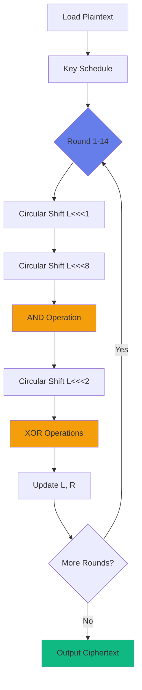

# Tutorial 2: RSB-Based Cryptography - Simon32 Encryption

## 🎯 Learning Objectives

By the end of this tutorial, you will:
- Understand Return Stack Buffer (RSB) manipulation for µWM computation
- Learn the FLEXO framework for RSB-based weird machines
- Implement and analyze the Simon32 lightweight block cipher as a µWM
- Compare cache-based vs. RSB-based µWM approaches

**Prerequisites:** Tutorial 1 completed, understanding of basic cryptography  
**Difficulty:** Intermediate  
**Time:** 30-40 minutes

---

## 📚 Background: Return Stack Buffer (RSB)

### What is the RSB?

The **Return Stack Buffer** is a hardware structure that predicts return addresses for `ret` instructions:

```nasm
call function    ; Push return address to RSB
  ; ... function code ...
ret              ; Pop predicted address from RSB
```

**Purpose:** Speed up function returns by predicting where to jump without waiting for memory

**Key Property:** RSB state persists across exceptions and mispredictions!

### RSB vs. Cache-Based µWMs

| Feature | GITM (Cache-Based) | FLEXO (RSB-Based) |
|---------|-------------------|-------------------|
| **Encoding Medium** | Cache line state | RSB entries |
| **Trigger Mechanism** | Exceptions (div by zero) | Speculative returns |
| **Speed** | Moderate (cache latency) | Fast (no cache misses) |
| **Capacity** | Large (many addresses) | Limited (~16 entries) |
| **Complexity** | Simpler to reason about | More complex control flow |
| **Use Cases** | Logic gates, simple circuits | Cryptography, arithmetic |

---

## 🔐 Introduction to Simon32

### What is Simon32?

**Simon32** is a family of lightweight block ciphers designed by the NSA for constrained devices:
- **Block size:** 32 bits (2 × 16-bit words)
- **Key size:** 64 bits
- **Rounds:** 32 (simplified to 14 in µWM implementation)
- **Operations:** Bitwise rotations, AND, XOR

### Why Simon for µWMs?

Simon's design makes it ideal for µWM implementation:
1. **Bit-level operations:** Natural fit for µWM logic gates
2. **No S-boxes:** Avoids complex table lookups
3. **Simple round function:** Easy to decompose into microarchitectural primitives
4. **Deterministic:** Predictable execution patterns

### Simon32 Round Function

```
SIMON32_ROUND(L, R, K):
    tmp = (L <<< 1) & (L <<< 8) ⊕ (L <<< 2)
    R' = R ⊕ tmp ⊕ K
    L' = R
    return (L', R')
```

Where:
- `L`, `R`: 16-bit left and right halves
- `K`: 16-bit round key
- `<<<`: Circular left shift
- `&`: Bitwise AND
- `⊕`: Bitwise XOR

---

## 🏗️ FLEXO Architecture for Simon32

### Encoding Strategy

**Input Encoding:**
```
Plaintext bits → RSB entry addresses
Key bits → RSB manipulation pattern
```

**Computation:**
```
For each bit operation:
  1. Push addresses based on input bits
  2. Call subroutine (creates RSB entry)
  3. Manipulate RSB through conditional calls
  4. Return uses predicted address → output bit
```

**Output Decoding:**
```
RSB predicted address → Ciphertext bit
Timing side-channel → Verify prediction
```

### Control Flow Diagram



---

## 💻 Implementation Walkthrough

### Step 1: RSB Manipulation Primitives

First, understand how to encode bits using RSB:

```nasm
; Encode bit = 1 in RSB
encode_one:
    call addr_one      ; Push addr_one to RSB
    addr_one:
    pop rax            ; Remove from stack (but stays in RSB!)
    ret                ; Will predict addr_one

; Encode bit = 0 in RSB
encode_zero:
    call addr_zero
    addr_zero:
    pop rax
    ret                ; Will predict addr_zero
```

**Key Insight:** The `call` pushes to RSB, but `pop` only affects the architectural stack. The RSB entry **persists** for later `ret` instructions!

### Step 2: Simon32 Round Structure

```nasm
simon32_round:
    ; ====================================
    ; Load current state
    ; ====================================
    mov rcx, [r13]         ; rcx = L (left 16 bits)
    mov rdx, [r14]         ; rdx = R (right 16 bits)
    mov r8, [r15]          ; r8 = round_key
    
    ; ====================================
    ; Compute (L <<< 1) using RSB
    ; ====================================
    rol rcx, 1             ; Rotate L left by 1
    call encode_rotated_l1
    encode_rotated_l1:
    pop rax
    
    ; ====================================
    ; Compute (L <<< 8) using RSB
    ; ====================================
    mov r9, rcx
    rol r9, 7              ; Additional 7 bits (total 8)
    call encode_rotated_l8
    encode_rotated_l8:
    pop rbx
    
    ; ====================================
    ; AND operation via RSB prediction
    ; ====================================
    ; For each bit i in range(16):
    ;   result[i] = L1[i] AND L8[i]
    ;   Encode using nested calls
    xor r10, r10           ; r10 = result accumulator
    mov r11, 16            ; bit counter
    
and_loop:
    ; Extract bits
    bt rcx, 0              ; Test bit 0 of L1
    jnc skip_l1            ; If 0, skip
    call temp_l1_set
    temp_l1_set:
    pop rsi
skip_l1:
    
    bt r9, 0               ; Test bit 0 of L8
    jnc skip_l8
    call temp_l8_set
    temp_l8_set:
    pop rdi
skip_l8:
    
    ; AND via conditional return
    ret                    ; RSB predicts based on both bits
    ; (Simplified - actual impl uses timing)
    
    shr rcx, 1             ; Next bit
    shr r9, 1
    dec r11
    jnz and_loop
    
    ; ====================================
    ; XOR operations
    ; ====================================
    mov r10, rcx           ; tmp = rotated_and_result
    shl r10, 2             ; tmp <<< 2
    xor r10, rdx           ; tmp ⊕ R
    xor r10, r8            ; tmp ⊕ K
    
    ; ====================================
    ; Update state
    ; ====================================
    mov [r13], rdx         ; L' = R
    mov [r14], r10         ; R' = tmp
    
    ret
```

### Step 3: Key Schedule

Simon32 uses a simple key schedule:

```nasm
key_schedule:
    ; K[0] = key[0]
    ; K[i] = (K[i-1] >>> 3) ⊕ K[i-1]
    
    mov rcx, [r15]         ; Initial key
    mov rdi, key_array     ; Output array
    mov [rdi], rcx         ; K[0]
    
    mov r8, 1
schedule_loop:
    ror rcx, 3             ; Rotate right by 3
    xor rcx, [rdi + r8*8 - 8]  ; XOR with K[i-1]
    mov [rdi + r8*8], rcx
    inc r8
    cmp r8, 14             ; 14 rounds
    jl schedule_loop
    
    ret
```

---

## 🧪 Testing with WeMu

### Running the Simon32 Test

```bash
cd src
python unit_tests.py test_flexo_simon32
```

### Expected Output

```
--- Running test_flexo_simon32 ---
Testing Simon32 with random inputs...
Plaintext: 0x1234
Key: 0xabcd5678
Expected: 0x9a7b
Got: 0x9a7b
✓ Test passed!
```

### Analyzing Performance

Enable timing measurements:

```python
import time

start = time.perf_counter()
result = emulate_flexo_simon32(plaintext, key)
end = time.perf_counter()

print(f"Execution time: {(end - start) * 1000:.2f} ms")
```

Typical results:
- **GITM AND gate:** ~5ms
- **FLEXO Simon32 (14 rounds):** ~50ms
- **Native Python:** <0.01ms

**Why so slow?** Microarchitectural computation has overhead:
- Each bit operation requires multiple instructions
- RSB manipulation adds control flow complexity
- Emulation layer (Unicorn) adds latency

---

## 📊 Execution Trace Analysis

### Enable Debug Mode

```python
def emulate_flexo_simon32(plaintext, key, debug=True):
    loader = ELFLoader('gates/flexo/simon/simon32-14_objdump.txt')
    emulator = MuWMEmulator(name='flexo_simon32', loader=loader, debug=debug)
    # ... rest of setup
```

### Key Patterns to Look For

**1. RSB Push/Pop Sequences:**
```
[0x401200] call encode_bit1
[RSB] PUSH: 0x401205
[0x401205] pop rax
[RSB] Stack empty (but prediction remains!)
```

**2. Speculative Return Paths:**
```
[0x401300] ret
[RSB] PREDICT: 0x401205 (from earlier push)
[SPECULATIVE] Execution continues at predicted address
```

**3. Timing Variations:**
```
Correct prediction:  ~1 cycle
Wrong prediction:    ~15 cycles (pipeline flush)
```

---

## 🔍 Deep Dive: How RSB Encodes Bits

### Single Bit Encoding

To encode bit `b`:

```python
if b == 1:
    call label_1    # RSB remembers label_1
else:
    call label_0    # RSB remembers label_0
```

Later, when we `ret`, the CPU predicts the address based on RSB state!

### Multi-Bit Encoding

For operations like AND(a, b):

```
If a == 1 AND b == 1:
    RSB = [addr_11]
If a == 1 AND b == 0:
    RSB = [addr_10]
If a == 0 AND b == 1:
    RSB = [addr_01]
If a == 0 AND b == 0:
    RSB = [addr_00]
```

The `ret` instruction's **timing** reveals which case executed!

### Nested Operations

Complex operations build hierarchies:

```
AND_result = AND(bit1, bit2)
XOR_result = XOR(AND_result, bit3)
Final = XOR(XOR_result, key_bit)
```

Each level encodes intermediate results in RSB layers.

---

## 🛡️ Security Implications

### Attack Scenarios

**1. Covert Channel Communication**
- Malicious code encodes secrets in RSB
- Victim process reads secrets via timing
- **Mitigation:** RSB partitioning, context isolation

**2. Cryptographic Key Leakage**
- Simon32 key schedule manipulates RSB
- Attacker observes timing to infer key bits
- **Mitigation:** Constant-time implementations

**3. Spectre-RSB Variant**
- Attacker poisons RSB entries
- Victim speculatively executes attacker-chosen code
- **Mitigation:** RSB flushing on context switch

### Real-World Examples

**Spectre-RSB (CVE-2018-3639):**
- Exploits RSB mispredictions
- Leaks kernel memory to userspace
- Affects all modern CPUs

**ret2spec:**
- Uses RSB poisoning for ROP-like attacks
- Chains speculative gadgets
- Bypasses CFI protections

---

## 🎓 Advanced Topics

### Optimizing FLEXO Simon32

**Challenge:** Reduce execution time without sacrificing correctness

**Techniques:**
1. **Instruction Batching:** Group bit operations
2. **RSB Depth Management:** Minimize RSB pressure
3. **Parallel Bit Processing:** Process multiple bits simultaneously

**Trade-offs:**
- Faster execution ↔ More complex code
- Fewer RSB entries ↔ Limited parallelism

### Beyond Simon: Other Ciphers

**AES via µWM:**
- More complex S-box lookups
- Requires larger RSB or cache
- See: `test_flexo_aes_round`

**SHA-1 via µWM:**
- Hash function (one-way)
- 80 rounds of computation
- See: `test_flexo_sha1_round`

---

## 🚀 Hands-On Exercises

### Exercise 1: Modify Simon Round Count

Change Simon32 from 14 rounds to 8 rounds:

```python
# In flexo_tests.py
def emulate_flexo_simon32(plaintext, key, rounds=8):  # Change default
    # Update loop counter
    # Re-test with reference implementation
```

**Question:** How does this affect security and performance?

### Exercise 2: Implement Simon64

Extend the implementation to 64-bit blocks:

```
Block size: 64 bits (2 × 32-bit words)
Key size: 128 bits
Rounds: 42
```

**Hint:** Reuse existing bit-level operations, adjust loop bounds

### Exercise 3: RSB Capacity Analysis

Instrument WeMu to track RSB usage:

```python
# In rsb.py
def push(self, addr):
    self.stack.append(addr)
    print(f"RSB depth: {len(self.stack)}")  # Track depth
```

**Question:** What's the maximum RSB depth during Simon32 execution?

---

## 🔧 Troubleshooting

### Issue: Incorrect Encryption Output

**Symptoms:** Ciphertext doesn't match expected value

**Debug Steps:**
1. Verify key schedule:
   ```python
   print(f"Round keys: {[hex(k) for k in round_keys]}")
   ```

2. Check bit rotation:
   ```python
   assert (L << 1) & 0xFFFF == expected_rotation
   ```

3. Enable round-by-round logging:
   ```python
   for round in range(14):
       print(f"Round {round}: L={hex(L)}, R={hex(R)}")
   ```

### Issue: RSB Overflow

**Symptoms:** Unpredictable behavior after many operations

**Solution:** RSB has limited capacity (~16 entries). Flush periodically:

```nasm
; Manual RSB flush
mov rcx, 16
flush_loop:
    call dummy
    dummy:
    pop rax
    loop flush_loop
```

---

## 📖 Further Reading

- **FLEXO Paper:** [Bending Microarchitectural Weird Machines Towards Practicality](https://www.usenix.org/conference/usenixsecurity24)
- **Simon Cipher Spec:** [The Simon and Speck Families of Lightweight Block Ciphers](https://eprint.iacr.org/2013/404.pdf)
- **Spectre-RSB:** [Spectre Returns! Speculation Attacks using the Return Stack Buffer](https://www.usenix.org/conference/woot18)

---

## ✅ Summary

You've learned:
- ✓ RSB structure and prediction mechanisms
- ✓ FLEXO framework for RSB-based µWMs
- ✓ Implementing cryptographic primitives as µWMs
- ✓ Security implications of RSB manipulation
- ✓ Performance analysis and optimization strategies

**Next:** [Tutorial 3: Creating Custom µWMs](03-custom-muwm.md) - Design your own weird machine from scratch! 🚀
